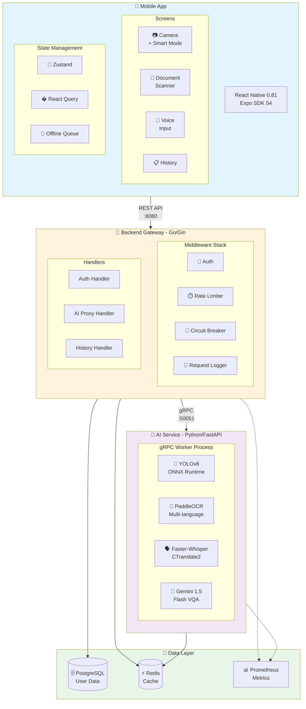
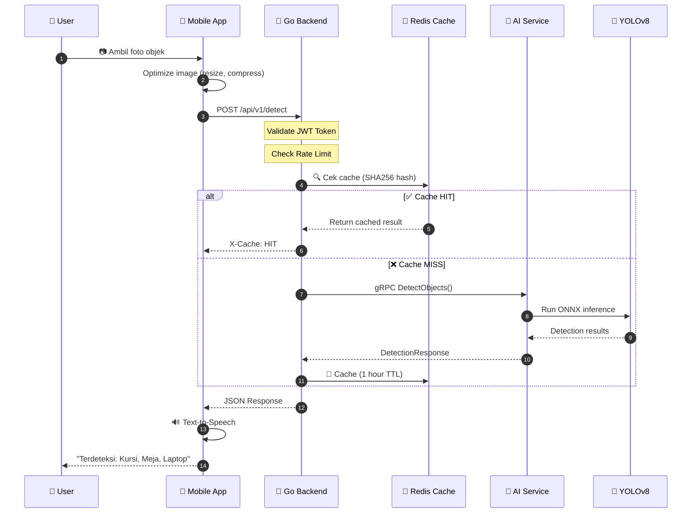
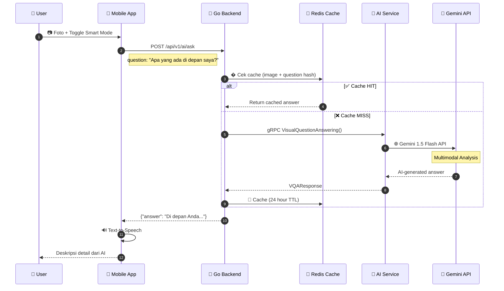
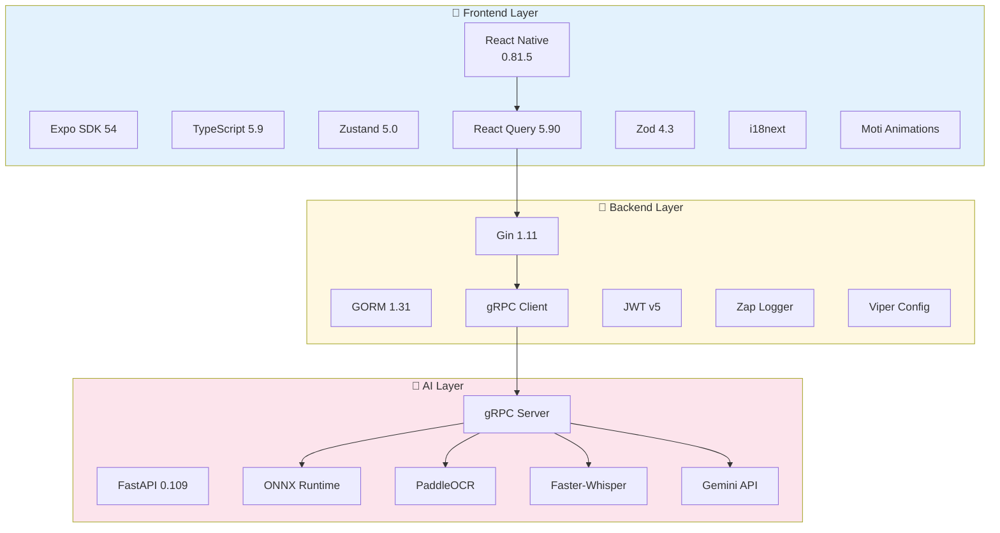
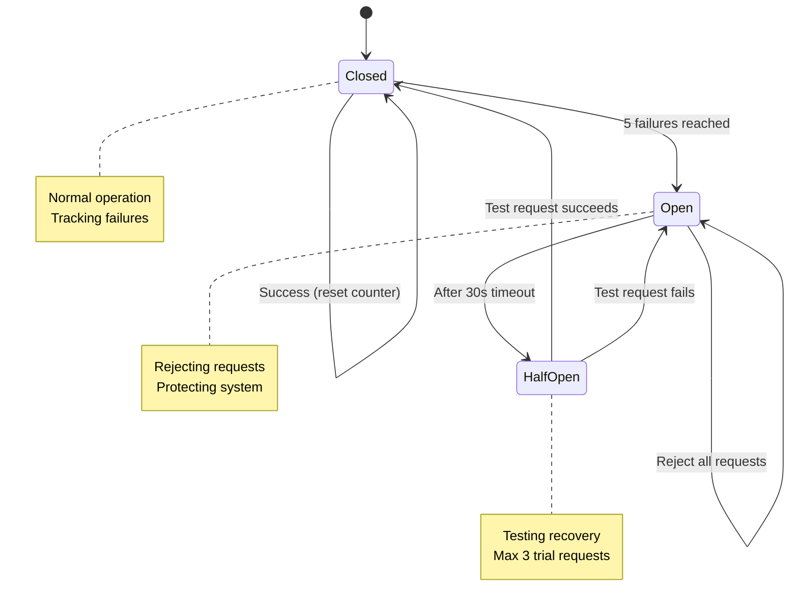
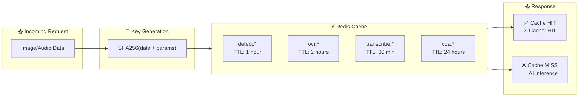
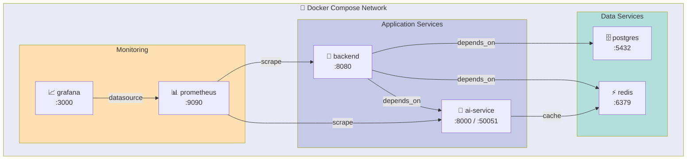

<p align="center">
  
</p>

<h1 align="center">👨‍🦯 TemanDifa</h1>

<p align="center">
  <strong>Aplikasi AI untuk Membantu Penyandang Disabilitas Netra</strong>
</p>

<p align="center">
  
  
  
  
  
</p>

<p align="center">
  
  
  
  
</p>

<p align="center">
  <a href="#-fitur-utama">Fitur</a> •
  <a href="#-arsitektur">Arsitektur</a> •
  <a href="#-quick-start">Quick Start</a> •
  <a href="#-api-documentation">API Docs</a>
</p>

---

## 📖 Tentang TemanDifa

**TemanDifa** adalah aplikasi mobile berbasis AI yang dirancang khusus untuk membantu penyandang disabilitas netra dalam aktivitas sehari-hari. Dengan memanfaatkan teknologi _Computer Vision_, _Speech Recognition_, dan _Generative AI_, TemanDifa menjadi **"teman"** yang selalu siap membantu.

### 🎯 Misi Kami

> _"Membuat teknologi AI dapat diakses oleh semua orang, tanpa terkecuali."_

- 👁️ Membantu identifikasi objek di sekitar pengguna
- 📄 Membacakan teks dari dokumen/gambar
- 🎤 Mengkonversi suara menjadi teks
- 🧠 Menjawab pertanyaan tentang gambar dengan AI
- ♿ Menyediakan antarmuka yang sepenuhnya aksesibel

---

## ✨ Fitur Utama

<table>
<tr>
<td width="50%">

### 📷 Deteksi Objek

Identifikasi objek di sekitar menggunakan **YOLOv8 + ONNX Runtime**.

- ✅ 80+ jenis objek COCO terdeteksi
- ✅ Optimized inference dengan ONNX
- ✅ Real-time hasil dengan confidence score
- ✅ Feedback audio otomatis (TTS)

</td>
<td width="50%">

### 🧠 Smart Mode (VQA)

Tanyakan apa saja tentang gambar dengan **Google Gemini 1.5 Flash**.

- ✅ Visual Question Answering
- ✅ Deskripsi detail untuk tunanetra
- ✅ Natural language responses
- ✅ Contextual understanding

</td>
</tr>
<tr>
<td width="50%">

### 📄 Pemindai Dokumen (OCR)

Ekstraksi teks dari gambar dengan **PaddleOCR**.

- ✅ Multi-bahasa (ID, EN, CH)
- ✅ Baca dokumen, menu, tanda
- ✅ Smart GPU fallback
- ✅ Pembacaan teks-ke-suara

</td>
<td width="50%">

### 🎤 Transkripsi Suara

Ubah suara menjadi teks dengan **Faster-Whisper**.

- ✅ CTranslate2 optimized
- ✅ Deteksi bahasa otomatis
- ✅ Akurasi tinggi
- ✅ Multiple audio formats

</td>
</tr>
<tr>
<td width="50%">

### 🔐 Keamanan & Aksesibilitas

- ✅ Login biometrik (Fingerprint/Face ID)
- ✅ Mode tamu tanpa registrasi
- ✅ JWT dengan token rotation
- ✅ Haptic feedback

</td>
<td width="50%">

### 📴 Offline-First

- ✅ Queue requests saat offline
- ✅ Auto-sync ketika online
- ✅ Persistent cache
- ✅ Network status indicator

</td>
</tr>
</table>

---

## 🏗 Arsitektur

### System Architecture



### Data Flow - Object Detection



### Data Flow - Visual Question Answering (VQA)



### Component Architecture



### Circuit Breaker Pattern



### Caching Strategy



### Docker Compose Services



---

## 🚀 Quick Start

### Prerequisites

- [Docker](https://www.docker.com/) & Docker Compose
- [Node.js](https://nodejs.org/) 18+ (untuk frontend)
- [Expo CLI](https://expo.dev/) (`npm install -g expo-cli`)
- **Google Gemini API Key** (untuk fitur VQA)

### 1️⃣ Clone Repository

```bash
git clone https://github.com/your-username/temandifa.git
cd temandifa
```

### 2️⃣ Setup Environment

```bash
# Copy environment template
cp .env.example .env

# Edit dan tambahkan:
# - JWT_SECRET (min 32 karakter)
# - GEMINI_API_KEY (untuk VQA)
nano .env
```

### 3️⃣ Jalankan Backend Services

```bash
# Start semua services dengan Docker Compose
docker-compose up -d

# Cek status
docker-compose ps

# Lihat logs
docker-compose logs -f backend ai-service
```

### Services yang Berjalan:

| Service         | Port  | URL                   | Deskripsi           |
| --------------- | ----- | --------------------- | ------------------- |
| **Backend API** | 8080  | http://localhost:8080 | Go API Gateway      |
| **AI Service**  | 8000  | http://localhost:8000 | Python AI Inference |
| **gRPC**        | 50051 | -                     | AI Service gRPC     |
| **PostgreSQL**  | 5432  | -                     | Database            |
| **Redis**       | 6379  | -                     | Cache & Rate Limit  |
| **Prometheus**  | 9090  | http://localhost:9090 | Metrics             |
| **Grafana**     | 3000  | http://localhost:3000 | Dashboard           |

### 4️⃣ (Opsional) Mengaktifkan GPU Support

Untuk performa inferensi AI yang lebih cepat (NVIDIA GPU required):

1. Pastikan **NVIDIA Container Toolkit** sudah terinstall.
2. Edit `docker-compose.yml`:
   ```yaml
   ai-service:
     build:
       dockerfile: Dockerfile.gpu # Ubah dari Dockerfile ke Dockerfile.gpu
     deploy:
       resources:
         reservations:
           devices:
             - driver: nvidia
               count: 1
               capabilities: [gpu]
   ```
3. Rebuild service: `docker-compose up -d --build ai-service`

### 5️⃣ Jalankan Mobile App

```bash
cd temandifa-frontend

# Install dependencies
npm install

# Start Expo development server
npx expo start
```

Scan QR code dengan **Expo Go** app di smartphone Anda.

---

## 📱 Tech Stack Detail

### Frontend (Mobile)

| Technology   | Version | Purpose                |
| ------------ | ------- | ---------------------- |
| React Native | 0.81.5  | Mobile framework       |
| Expo SDK     | 54      | Development platform   |
| TypeScript   | 5.9     | Type safety            |
| Zustand      | 5.0     | State management       |
| React Query  | 5.90    | Server state & caching |
| Zod          | 4.3     | Runtime validation     |
| i18next      | 25.7    | Internationalization   |
| Moti         | 0.30    | Animations             |
| Sentry       | 7.2     | Error tracking         |

### Backend (API Gateway)

| Technology | Version | Purpose                  |
| ---------- | ------- | ------------------------ |
| Go         | 1.25    | Programming language     |
| Gin        | 1.11    | HTTP framework           |
| Uber Fx    | 1.20    | Dependency Injection     |
| GORM       | 1.31    | ORM for PostgreSQL       |
| JWT v5     | 5.3     | Authentication           |
| gRPC       | 1.78    | AI service communication |
| Zap        | 1.27    | Structured logging       |
| Viper      | 1.21    | Configuration            |
| Prometheus | 1.23    | Metrics                  |

### AI Service

| Technology     | Version   | Purpose               |
| -------------- | --------- | --------------------- |
| Python         | 3.x       | Programming language  |
| FastAPI        | 0.109     | HTTP API              |
| gRPC           | latest    | Backend communication |
| ONNX Runtime   | 1.17      | YOLOv8 inference      |
| PaddleOCR      | 2.7       | Text extraction       |
| Faster-Whisper | 1.0       | Audio transcription   |
| Gemini API     | 1.5 Flash | Visual QA             |

---

## 📚 API Documentation

### Authentication

| Method | Endpoint           | Description           |
| ------ | ------------------ | --------------------- |
| `POST` | `/api/v1/register` | Register new user     |
| `POST` | `/api/v1/login`    | Login & get tokens    |
| `POST` | `/api/v1/refresh`  | Refresh access token  |
| `POST` | `/api/v1/logout`   | Logout & revoke token |

### AI Features

| Method | Endpoint             | Description                   |
| ------ | -------------------- | ----------------------------- |
| `POST` | `/api/v1/detect`     | Object detection (YOLOv8)     |
| `POST` | `/api/v1/ocr`        | Text extraction (PaddleOCR)   |
| `POST` | `/api/v1/transcribe` | Audio transcription (Whisper) |
| `POST` | `/api/v1/ai/ask`     | VQA (Gemini)                  |

### History

| Method   | Endpoint              | Description         |
| -------- | --------------------- | ------------------- |
| `GET`    | `/api/v1/history`     | Get user history    |
| `POST`   | `/api/v1/history`     | Save to history     |
| `DELETE` | `/api/v1/history/:id` | Delete history item |
| `DELETE` | `/api/v1/history`     | Clear all history   |

📖 **Swagger UI**: http://localhost:8080/swagger/index.html

---

## 🔧 Environment Variables

### Root `.env`

```env
# Database
DB_USER=postgres
DB_PASSWORD=your_secure_password
DB_NAME=temandifa

# JWT (WAJIB min 32 karakter untuk production!)
JWT_SECRET=your-super-secret-jwt-key-minimum-32-chars

# Gemini API (WAJIB untuk fitur VQA/Smart Mode)
GEMINI_API_KEY=your-gemini-api-key
```

### Frontend `.env`

```env
EXPO_PUBLIC_API_URL=http://10.0.2.2:8080/api/v1
```

---

## 📁 Project Structure

```
temandifa/
├── 📱 temandifa-frontend/          # React Native mobile app
│   ├── App.tsx                     # Entry point
│   └── src/
│       ├── components/             # UI components (Atomic Design)
│       │   ├── atoms/              # ThemedText, ThemedView
│       │   ├── molecules/          # FeatureCard, LoadingOverlay
│       │   └── organisms/          # ErrorBoundary
│       ├── screens/                # 11 App screens
│       ├── services/               # 11 API services
│       ├── stores/                 # Zustand (auth, theme)
│       ├── hooks/                  # Custom hooks
│       ├── schemas/                # Zod validation
│       └── i18n/                   # Localization
│
├── 🔧 temandifa-backend/           # Go API gateway
│   ├── cmd/server/main.go          # Entry point
│   └── internal/
│       ├── handlers/               # HTTP handlers (5)
│       ├── middleware/             # Auth, rate limit, etc. (6)
│       ├── services/               # Business logic (6)
│       ├── models/                 # GORM models (6)
│       └── clients/                # gRPC client
│
├── 🤖 temandifa-ai-service/        # Python AI service
│   ├── Dockerfile                  # CPU Dockerfile
│   ├── Dockerfile.gpu              # GPU Dockerfile (CUDA 12.1)
│   └── app/
│       ├── main.py                 # FastAPI + gRPC process spawn
│       ├── worker.py               # gRPC server with models
│       ├── services/               # YOLO, OCR, Whisper, VQA
│       └── core/                   # Config, middleware, metrics
│
├── 📋 proto/                       # gRPC Protobuf definitions
├── 📊 prometheus/                  # Monitoring config
├── 🐳 docker-compose.yml           # Container orchestration
└── 📖 README.md
```

---

## 🤝 Contributing

Contributions are welcome! Please follow these steps:

1. **Fork** the repository
2. Create feature branch: `git checkout -b feature/AmazingFeature`
3. Commit changes: `git commit -m 'Add AmazingFeature'`
4. Push to branch: `git push origin feature/AmazingFeature`
5. Open a **Pull Request**

---

## 📄 License

This project is licensed under the **MIT License** - see the [LICENSE](LICENSE) file for details.

---

## 👥 Team

<table>
<tr>
<td align="center">
  <strong>TemanDifa Development Team</strong><br>
  <em>Building technology for accessibility</em>
</td>
</tr>
</table>

---

<p align="center">
  Made with ❤️ for accessibility
</p>

<p align="center">
  <strong>**TemanDifa** - Teman Setia Penyandang Disabilitas Netra</strong>
</p>

<p align="center">
  <a href="#-temandifa">Back to top ⬆️</a>
</p>
